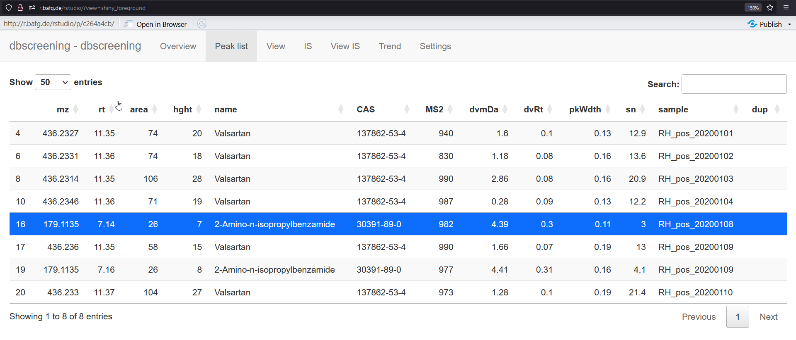

```{r setup, include = FALSE}
library(ggplot2)

knitr::opts_chunk$set(
  collapse = TRUE,
  comment = "#>"
)
```


# Introduction

Data evaluation using the MS^2^ spectral database is carried out in the command line and visualization of the results can be done using the browser-based visualization tool. This document briefly outlines the procedure. For more details of the specific R functions please refer to the documentation in the ntsworkflow package.

# Step-by-step guide
## Step 1 
Attach ntsworkflow, the Rcpp warning message is normal and due to xcms 
```{r, message=FALSE, warning=FALSE}
library(ntsworkflow)
```

## Step 2 
Create new Report object, the name "test" can be anything you wish, as long as it starts with a letter and not something already used by R.
```{r}
test <- Report$new()
```

## Step 3 
Load some raw files, either interactively by running: 
```{r, eval = FALSE}
test$addRawFiles()
```

...or you can type in the file locations, e.g. 
```{r}
listOfFiles <- c(
    "example1.mzXML",
    "example2.mzXML"
  )
test$addRawFiles(dialog = FALSE, normalizePath(listOfFiles))
```

You can view the current files in the report by running `*$rawFiles`. The number indicates the position of the file.
```{r}
test$rawFiles
```

## Step 4 
Import an IS table. The IS table must be a csv file with 4 columns: name, formula, rt, adduct. Where formula is in the form e.g. for CBZ-IS: "C14 13CH12N 15NO", and adduct is in the form [M+H]+, [M]+, etc. This can also be done with a dialog or by typing in the path.
```{r}
# With prompt: test$addIS()
test$addIS(dialog = FALSE, "IS_table_pos.csv")
```
```{r}
test$IS
```

## Step 5 
The settings have been given default values already, to view the settings

```{r, eval=FALSE}
test$settings
```

```{r, results='asis', echo=FALSE}
values <- sapply(test$settings, function(x) if (length(x) > 1) Reduce(paste, x) else paste(x))
values[1] <- "D:/Example/sqlite/MS2db.db"
knitr::kable(data.frame(Name = names(test$settings), Value = values), row.names = FALSE,
             caption = "Settings used by the suspect search algorithm")
```

For detailed explainations of what each setting does, please refer to the documentation of Report-class, e.g. by typing `help("Report-class")`. 

### Connecting the database
The `db_path` variable needs to be set to location of the database. To change any variable use the function `*$changeSettings(parameter, value)`, where parameter is the name of the setting to change and value is the new value. To know what type of values can go in each parameter, check the documentation.
```{r}
test$addDB(dialog = FALSE, "example_database.db")
```

## Step 6 
Process the files. This takes around 5 min in this example but could take much longer! All files that still need processing will be loaded into the RAM, so if you do not have much memory, add and process the files in batches (use `*.clearData()` to remove data from RAM). During processing, some information will be printed onto the console.
```{r, message=FALSE, warning=FALSE}
test$process_all()
```

The results are stored in different tables. The main result file, the peak list, is stored in the `*$peakList` field, which is a `data.frame`. For example we can access part of the peak list by typing `test$peakList[1:10, c(1:3, 13)]`:
```{r, results="asis", echo=FALSE}
knitr::kable(test$peakList[1:2, c(1:2,22,12:13)], caption="Excerpt of the peak list")
```

There is also a table of IS integration results.
```{r, results="asis", echo=FALSE}
knitr::kable(test$ISresults[, 1:5], caption = "IS integration results")
```

If you want to view a specific compound's peak, or spectrum, you can use these methods:
```{r, fig.cap="EIC plot from peak with ID 21, lamotrigine in this case.", fig.width=5, fig.height=3}
test$plotEIC(1)  # you must provide the peakID, which is found in the peak list
```

\pagebreak

```{r, fig.cap="MS^1^ plot from peak with ID 21, lamotrigine in this case.", fig.width=5, fig.height=3}
test$plotMS1(1)
```

```{r, fig.cap="MS^2^ plot from peak with ID 21, lamotrigine in this case.", fig.width=5, fig.height=3}
test$plotMS2(1)
```

In the MS^2^ spectrum, the score is from 0 to 1000 and represents how good the match is (dot_product algorithm "purity").[^1]  

[^1]: Sokolow S, Karnofsky J, Gustafson P. The Finnigan Library Search Program, 1978.

# Viewing the results 

To view all the results in an interactive environment run the visualisation app by executing `test$view()`. This starts an interactive shiny display of the results.

There are several tabs:

## Peak list
{#id .class width=300px}

You can select a compound and then click on the view tab to see the spectra. These images are from a full data evaluation and not the example shown above.

## View
Here you can see the EIC, MS^1^ and MS^2^ spectrum of the selected peak from the peak list tab. You can also directly enter peak ID at the top or scroll through all the peaks using the mouse.

{#id .class width=300px}

## IS
Here the results of the IS integration are displayed.

## View IS
The peak area, peak width and RT stability are given for all IS in all samples.

## Trend
This tab shows the intensity (area or height) changes of all the compounds in all samples. There is also the option to show normalized values according to a specific IS. Dark blue means the compound was identified in this sample by MS^2^. Light blue means this peak area is obtained by reintegration (see below). Red means there is no IS found in this sample so the IS area is estimated based on previous analysis. By zooming into the chart a peak is selected (yellow background), this peak can then be viewed in the view tab.

{#id .class width=300px}

# False positives

If you notice a false positive, you can delete this by running `test$deleteFP(name)` with the name of the compound you want to delete. It must match exactly so it is best to copy from the peak-list.
```{r, eval=FALSE}
test$deleteFP("Benzyl-dimethyl-hexadecylammonium")
```

This will also add guanosine to the `test$falsePos` field. Any compounds in this set will be deleted from all future processing results. To obtain results from guanosine from future processing or reprocessing, you must remove guanosine from the `falsePos` field, e.g.:

```{r, eval=FALSE}
test$falsePos <- test$falsePos[test$falsePos != "Guanosine"]
```

# Blank removal

If you have also processed blank files together with data files, there is a method to remove peaks also found in the blank `test$deleteBackground(indicesData, indicesBlank, includeIS = FALSE)`. This works simply by comparing the compound names, i.e., the two peaks in blank and sample must have been assigned the same compound name for this to work. Also, if any peaks have intensity `NA` (meaning peak integration found no peak), these will be skipped and not removed. You must indicate the indices of the "samples" and the "blanks" based on the `test$rawFiles` variable. If you have problems with IS background signals, it will also remove IS found in blank if you set `includeIS = TRUE`. By default the intensity in the sample must be within 5x the intensity in the blank if it is to be removed. This can be changed in the `test$settings$blank_int_factor` variable.

```{r, eval = FALSE}
test$deleteBackground(3, 2)  # will not delete IS peaks
test$deleteBackground(3, 2, includeIS = TRUE)
```


# Peak instensity of NA

A peak intensity of NA means the peak integration failed. These peaks can be removed by simple subsetting

```{r, eval=FALSE}
test$peakList <- test$peakList[!is.na(test$peakList$int_a), ]
```

# Reintegration
Sometimes the MS^2^ is not acquired and the compound is not detected one of the samples in a long series. You can reintegrate all samples using only the exact mass and RT of each detected suspect. In this fashion no MS^2^ comparison is done. This is only to get better trends. Be aware that if no peak is present, the program will still try to integrate the noise, so there will sometimes be a "baseline" intensity.
```{r, eval=FALSE}
test$reIntegrate()
```

To view the reintegration results, use `test$view()` or `test$integRes`.

# Saving and loading for later use

## Settings
To save the settings for later use use
```{r, eval=FALSE}
test$saveSettings()
```

This saves the settings as a .json file in the current workspace. This can be loaded again with `test$loadsettings()`

## Saving and loading the report

You can save your results into a `.report` file. Before saving, the raw data files will be cleared from the RAM. 
```{r, eval=FALSE}
test$clearAndSave()

# Or, if you want to give it another name or location
test$clearAndSave("D:\\testFolder\\example_test")  
```

load a .report file back to the R environment
```{r, eval=FALSE}
newName <- ntsworkflow::loadReport("example_test.report")
```

To save any table in the report object as a csv file, use `write.csv`. For German Excel, use `write.csv2`.
```{r, eval=FALSE}
write.csv(test$peakList, file = "new_peaklist.csv")
```


